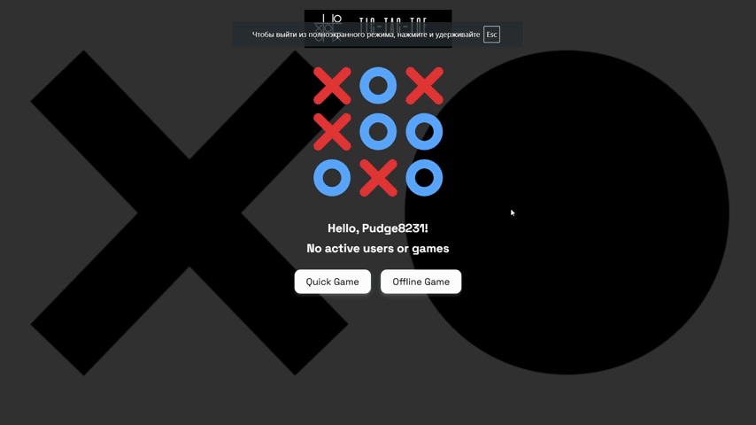

# Online Tic-Tac-Toe

       

A real-time online and offline Tic-Tac-Toe game built with Go (backend) and static frontend (HTML/CSS/JS), using WebSocket communication and PostgreSQL for persistent user data.

## Gameplay



## Project Structure

- **Frontend**: Static HTML/CSS/JavaScript served via Nginx.
- **Backend**: Go server with Gin framework handling REST APIs and WebSocket communication.
- **Database**: PostgreSQL for storing users and games.
- **Cache**: Redis for sessions and matchmaking queues.
- **Deployment**: Docker + Docker Compose.

## How to Run Locally

1. **Clone the repository:**
   ```bash
   git clone https://github.com/azhaxyly/online-tic-tac-toe.git
   cd online-tic-tac-toe
   ```

2. **Setup environment variables:**
   Create a `.env` file inside `/backend/`:
   ```bash
   POSTGRES_USER=postgres
   POSTGRES_PASSWORD=postgres
   POSTGRES_DB=tictactoe
   ```

3. **Run the application:**
   ```bash
   docker-compose up --build
   ```

4. **Access the app:**
   Open [http://localhost:8080](http://localhost:8080) in your browser.


## API Documentation

### WebSocket

**Connect:**
```
GET /ws
```
- Requires valid `session_id` cookie.
- WebSocket Events:
  - `find_match`, `cancel_match`, `move`, `forfeit`, `request_rematch`, `accept_rematch`, `decline_rematch`, `rejoin_match`
- Server Responses:
  - `match_found`, `move_made`, `game_state`, `game_over`, `opponent_left`, `rematch_requested`, `rematch_declined`, `rematch`

### REST API

| Method | Endpoint            | Description                      |
|:------:|:-------------------- |:-------------------------------- |
| GET    | `/api/nickname`       | Get assigned nickname            |
| GET    | `/api/stats`          | Get online users and active games|
| GET    | `/api/profile-stats`  | Get user game history stats      |

Example response for `/api/stats`:
```json
{
  "online": 5,
  "active_games": 2
}
```

## Key Features

- **Quick Matchmaking**: Instantly find an opponent online.
- **Offline Mode**: Play against yourself without network.
- **WebSocket Real-Time Updates**: Smooth gameplay with live moves.
- **Redis Session Management**: Fast and scalable.
- **Animated Start Screen**: Interactive and dynamic UI.
- **Responsive Layout**: Works across all device sizes.


## Technologies Used

- **Backend**: Go, Gin
- **Frontend**: HTML5, CSS3, Vanilla JS
- **WebSocket**: Gorilla WebSocket
- **Database**: PostgreSQL 16
- **Cache**: Redis 7
- **Server**: Nginx
- **Deployment**: Docker, Docker Compose

## License

This project is licensed under the Apache License.


## Author

[](https://platform.alem.school/git/azhaxyly) <a href="https://t.me/hmlssdeus" target="_blank"></a>

